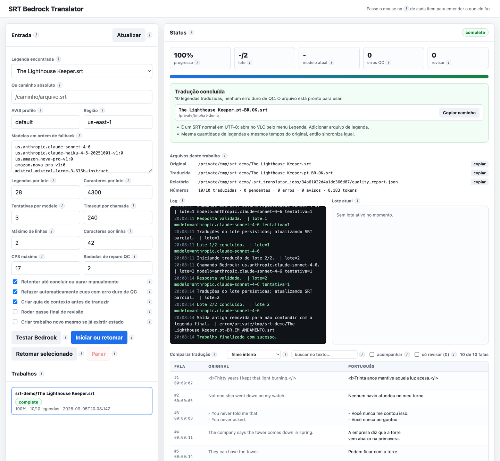
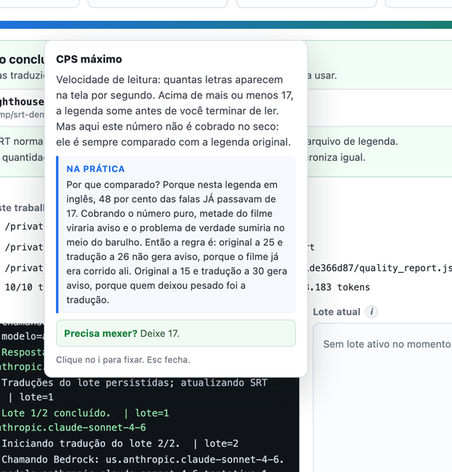
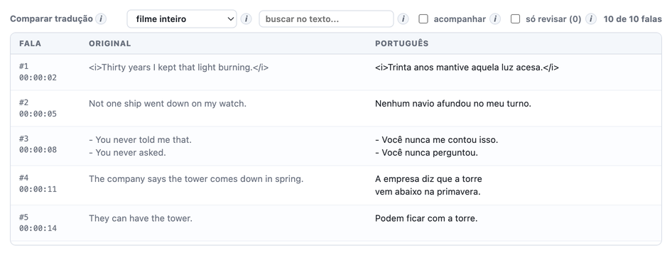

# SRT Bedrock Translator


Traduz legendas `.srt` para português brasileiro com LLMs, feito para não te deixar na
mão: retoma de onde parou, nunca desiste em silêncio e diz no nome do arquivo se o
resultado ficou bom.

Sai da caixa com Amazon Bedrock, mas o ponto de integração é **uma única classe** — dá
para trocar por OpenAI, Anthropic, Gemini ou Ollama com uma chave de API.
[Veja como](#usar-com-outra-llm-em-vez-do-bedrock).

> **English:** A resumable, quality-checked `.srt` subtitle translator built on Amazon
> Bedrock, with a local web UI. It survives crashes, network failures and model refusals,
> and marks the output file `OK` or `INCOMPLETO` so you always know what you got. Swapping
> Bedrock for an API-key provider means implementing one method. Docs are in Portuguese;
> the code and CLI are self-explanatory.



*Tudo numa tela só: à esquerda a legenda e os ajustes, à direita o progresso, o log ao vivo,
o arquivo gerado e a tradução saindo lado a lado com o original.*

---

## Por que não é só um `for` chamando uma LLM

Traduzir legenda parece simples até você tentar num filme inteiro. O que quebra:

| O que acontece na prática | O que esta ferramenta faz |
|---|---|
| Traduzir linha a linha perde o contexto e o personagem muda de tratamento no meio | Traduz em blocos, cada um enxergando o bloco anterior já traduzido e o seguinte, e fechando numa pausa da cena em vez de no meio de um diálogo |
| Inglês não marca gênero e português exige: a mesma personagem vira ora "Meritíssimo", ora "Meritíssima" | Um glossário com gênero por personagem acompanha todos os blocos, e o QC acusa quem usar a outra forma |
| Nomes e apelidos mudam de tradução ao longo do filme | Gera um guia do filme no início e envia junto em todos os blocos |
| O modelo se recusa a traduzir letra de música achando que é pedido de letra | Contrato de resposta obrigatório e detecção de recusa, com nova tentativa e troca de modelo |
| A resposta vem cortada ou fora do formato | A tradução é pedida como ferramenta, então a API devolve estrutura já validada; o que ainda escapar é validado aqui, com o motivo da recusa realimentado na tentativa seguinte |
| Cai a internet no bloco 60 de 87 | O progresso está em disco; retomar continua do 61 sem retraduzir nem cobrar de novo |
| Sobra um trecho sem traduzir e você só descobre assistindo | Controle de qualidade local e o resultado estampado no nome do arquivo |
| Refrão de música devia ficar igual, mas a validação acha que é erro | Dois modelos concordando no mesmo texto derrubam a suspeita, em vez de travar |

Sem dependências: só a biblioteca padrão do Python e o AWS CLI.

## Destaques

- **Retoma de onde parou.** Fechou o notebook, matou o processo, acabou a bateria: nada
  se perde e nada é pago duas vezes.
- **Não desiste em silêncio.** Erro de rede, limite de uso ou resposta quebrada viram nova
  tentativa com espera crescente, e caem para o próximo modelo da fila.
- **O nome do arquivo é o relatório.** Sai `.pt-BR.OK.srt` ou `.pt-BR.INCOMPLETO.srt`. Uma
  legenda incompleta pode ser reenviada para completar só o que faltou.
- **Controle de qualidade local.** Itálico quebrado, símbolo de música perdido, trecho que
  ficou em inglês, linha longa e velocidade de leitura — medida contra a legenda original,
  não contra um número fixo.
- **Interface web** com log ao vivo, e um ícone **ⓘ** ao lado de cada campo explicando o
  que faz, com exemplo. Nada de adivinhar o que é "CPS máximo".

## Começando

Você precisa de:

| Requisito | Como conferir |
|---|---|
| Python 3.10 ou mais novo | `python3 --version` |
| AWS CLI configurado | `aws configure list-profiles` |
| Acesso liberado a algum modelo do Bedrock | veja abaixo |

O acesso aos modelos **não vem liberado por padrão**. No console da AWS, abra
**Amazon Bedrock → Model access** e peça acesso aos modelos que quiser usar. A liberação
costuma ser imediata. Sem isso, toda chamada volta com `AccessDeniedException`.

Configure uma vez:

```bash
git clone https://github.com/thiagomes07/srt-bedrock-translator.git
cd srt-bedrock-translator
cp srt_translator.local.json.example srt_translator.local.json
```

```json
{
  "profile": "default",
  "region": "us-east-1"
}
```

Esse arquivo não vai para o git. Se preferir, use `AWS_PROFILE` e `AWS_REGION` — elas têm
prioridade sobre ele.

Confirme que está tudo de pé antes de gastar tempo com um filme inteiro:

```bash
python3 srt_bedrock_translator.py doctor
```

## Como abrir a UI

```bash
python3 srt_bedrock_translator.py ui
```

Abra `http://127.0.0.1:8765/`.

Para trabalhar com as legendas de outra pasta, aponte para ela:

```bash
python3 srt_bedrock_translator.py ui --base "/caminho/da/pasta/do/filme"
```

Se a porta estiver ocupada, use `--port 8766`.

Na tela: escolha a legenda no primeiro campo, clique em **Testar Bedrock** se for a
primeira vez do dia, e depois em **Iniciar ou retomar**.

Nenhum campo exige que você saiba o que ele significa. Todo campo, botão, número e métrica
tem um ícone **ⓘ** que abre uma explicação com exemplo concreto — e diz se você precisa
mexer, o que quase nunca é o caso:



Enquanto roda você acompanha progresso, bloco atual, modelo em uso e o log colorido. E vê
a tradução saindo, original de um lado e português do outro, sem precisar abrir o arquivo:



Terminado, dá para trocar a lista para o filme inteiro e usar a busca para conferir como um
nome ou uma expressão foi resolvida em todas as vezes que aparece. Ao final, a tela mostra o
nome e a pasta do arquivo gerado, com botão de copiar o caminho.

## Como traduzir pelo terminal

```bash
python3 srt_bedrock_translator.py translate "arquivo.srt"
```

Para a melhor qualidade possível, com uma segunda passada de revisão (dobra o tempo e o
custo):

```bash
python3 srt_bedrock_translator.py translate "arquivo.srt" --polish-pass
```

Opções mais usadas:

| Opção | Para quê |
|---|---|
| `--profile` / `--region` | sobrescrevem a configuração local |
| `--models a,b,c` | define a fila de modelos |
| `--batch-size 20` | blocos menores, quando as respostas vêm quebradas |
| `--max-cues 20` | traduz só as primeiras legendas, para testar rápido |
| `--polish-pass` | segunda passada de revisão |

Veja tudo com `python3 srt_bedrock_translator.py translate --help`.

## Os arquivos que ele gera

Tudo fica na mesma pasta da legenda original.

| Arquivo | O que é |
|---|---|
| `*.pt-BR.EM_ANDAMENTO.srt` | parcial, enquanto trabalha |
| `*.pt-BR.OK.srt` | pronto, sem erro grave |
| `*.pt-BR.INCOMPLETO.srt` | terminou faltando coisa |
| `*.translator-state.json` | etiqueta que liga a legenda ao trabalho que a gerou |
| `.srt_translator_jobs/` | progresso, log e relatório de qualidade |

A legenda traduzida é um `.srt` comum em UTF-8, com a mesma quantidade de legendas e os
mesmos tempos do original — sincroniza igual e abre direto no player. Ao terminar, as
versões antigas daquele trabalho são apagadas, para não sobrar arquivo parecido
confundindo qual é o bom.

## Retomar um trabalho

Três caminhos, todos equivalentes:

- Na UI, selecione a legenda e clique em **Iniciar ou retomar**.
- No terminal, rode o mesmo comando `translate` de novo.
- Passe a legenda `*.INCOMPLETO.srt` como entrada: pelo arquivo de etiqueta ao lado dela,
  ele reconhece o trabalho de origem e completa só o que faltou.

Se a interface mostrar `stalled`, significa que o progresso está salvo mas o processo
morreu. Clique em **Retomar selecionado**.

## Usar com outra LLM em vez do Bedrock

O Bedrock não é obrigatório. Toda a conversa com o modelo passa por **um único método**,
`BedrockClient.converse`, que hoje chama o AWS CLI. Para usar uma chave de API, escreva
uma classe com a mesma assinatura e devolva ela na função `make_llm_client` — é o único
lugar do código que decide qual provedor usar:

```python
def make_llm_client(profile, region, timeout, logger):
    return MinhaLLMClient(profile, region, timeout, logger)
```

O contrato que sua classe precisa cumprir:

```python
class MinhaLLMClient:
    def __init__(self, profile: str, region: str, timeout: int, logger): ...

    def converse(
        self,
        model_id: str,
        system_text: str,
        user_text: str,
        *,
        max_tokens: int,
        temperature: float = 0.2,
    ) -> tuple[str, dict]:
        # devolve (texto_da_resposta, meta)
        # meta = {"usage": {...}, "stopReason": "end_turn" | "max_tokens", ...}
        # em falha, levante:
        #   BedrockCallError(msg, retryable=True)          -> tenta de novo
        #   BedrockCallError(msg, unavailable_model=True)  -> pula esse modelo
        ...
```

Três detalhes que valem a atenção, porque o resto do sistema depende deles:

- **`stopReason == "max_tokens"`** precisa ser reportado. É assim que a ferramenta sabe
  que a resposta veio cortada e aumenta o orçamento na tentativa seguinte.
- **`retryable`** separa falha temporária (rede, limite de uso) de falha definitiva
  (parâmetro inválido). A primeira espera e tenta de novo; a segunda troca de modelo.
- **`usage`** alimenta o contador de tokens da interface. Se seu provedor não devolver,
  mande `{}` — nada quebra, o contador só fica zerado.

Todo o resto — blocos com contexto, guia do filme, validação, retomada, controle de
qualidade, consenso entre modelos, interface — é agnóstico de provedor e continua
funcionando. Os IDs de modelo no campo "Modelos em ordem de fallback" passam a ser os do
seu provedor.

PRs adicionando provedores prontos são muito bem-vindos.

## Como a qualidade é garantida

Cada bloco vai ao modelo com o bloco anterior já traduzido, o bloco seguinte como
contexto, o guia do filme e o glossário de termos já decididos. A tradução é pedida
através de uma **ferramenta** com schema, e não como JSON escrito em prosa: a API valida
e devolve a estrutura pronta, o que elimina a classe de falha em que uma aspa dentro da
fala quebrava o bloco inteiro. Modelos que não aceitam ferramenta caem para o contrato em
texto automaticamente.

A parte do prompt que não muda entre blocos — regras, guia do filme e glossário — vai
num prefixo em cache, cobrado a cerca de um décimo nas chamadas seguintes. Num filme de
duas horas isso é perto de um terço da entrada, e entrada é o que domina o custo aqui.

### Revisão de sentido (desligada por padrão)

As checagens acima são todas estruturais e nenhuma delas percebe um erro escrito em
português impecável. Existe um passe que procura exatamente isso: um segundo modelo relê
pares de original e tradução e aponta onde o sentido está errado.

**Ele vem desligado, e a medição explica por quê.** Rodado sobre 400 falas de um filme já
traduzido, o funil foi: 17 apontadas, 8 sobreviveram aos filtros, 3 confirmadas por um
segundo modelo. Dessas 3, uma era melhoria real, uma era discutível e **uma teria piorado a
legenda** — o juiz quis trocar "Discorde à vontade" por "Implore à vontade" sem perceber que
a fala anterior fora traduzida como "Discordo respeitosamente" e que o trocadilho morreria.

No filme inteiro isso custa cerca de **40% a mais** para render em torno de uma melhoria
real a cada 400 falas, com risco comparável de estragar o que estava certo.

```bash
python3 srt_bedrock_translator.py translate "arquivo.srt" --semantic-review
```

Ligada, ela apenas **relata**: as falas apontadas aparecem no contador `revisar` para você
conferir. Para deixá-la reescrever sozinha, acrescente `--semantic-autofix` — sabendo do
caso acima. Restrinja o custo com `--semantic-min-signals 1`, que limita às falas com sinal
de risco, mas atenção: na medição, 2 das 3 confirmadas não tinham sinal nenhum.

**Gênero.** O guia registra o gênero de cada pessoa e de cada forma de tratamento, porque
o inglês não marca e o português obriga a escolher. Sem isso a mesma personagem muda de
gênero ao longo do filme, e nenhuma checagem estrutural percebe. O glossário viaja em
todos os blocos e o QC acusa qualquer cue que use a outra forma de um termo já fixado.

O controle de qualidade separa dois níveis:

- **Erro grave** — texto vazio, recusa do modelo, tag `<i>` desbalanceada, símbolo `♪`
  perdido, trecho que ficou em inglês. Enquanto existir, o arquivo sai como `INCOMPLETO`.
- **Aviso** — mais de duas linhas, linha acima de 42 caracteres, leitura rápida demais.
  Fica no relatório, mas não bloqueia o arquivo.

A velocidade de leitura é medida **contra a legenda original**, não contra um número fixo.
Muita legenda comercial já passa do limite confortável na fonte; cobrar o número absoluto
marcaria metade do filme e esconderia o problema real. O aviso só aparece quando a
tradução ficou mais de 15% mais lenta de ler do que o original já era.

### Quando a heurística erra: consenso entre modelos

"Parece não traduzido" é heurística, e heurística erra. Refrão de música
(`♪ Guli guli guli guli ram sam sam ♪`), onomatopeia e nome repetido são texto que deve
mesmo ficar igual ao original.

Para isso não travar o trabalho:

1. a falha de heurística é tratada como *leve*: a resposta é estruturalmente válida, só o
   texto é suspeito;
2. cada nova tentativa leva no pedido o motivo da recusa anterior e quais falas corrigir;
3. se dois modelos diferentes devolvem exatamente as mesmas falas suspeitas, a tradução é
   aceita e essas falas ficam marcadas como **revisar**;
4. falas aceitas por consenso viram aviso, não erro grave, então não bloqueiam o `OK`.

Quebra estrutural nunca é aceita por consenso: resposta ilegível, fala faltando ou
sobrando, recusa explícita, tag desbalanceada e símbolo de música perdido continuam sendo
erro grave.

## Custo

O custo é o do provedor, cobrado por token na sua conta — a ferramenta é gratuita. Como
ordem de grandeza: um filme de cerca de 2.400 legendas consumiu por volta de 800 mil
tokens no total, entre entrada e saída, usando Claude Sonnet como modelo principal.
`--polish-pass` praticamente dobra isso.

A interface mostra o consumo **por modelo** — chamadas, tokens de entrada, tokens servidos
do cache e tokens de saída — com o custo estimado em dólar ao lado.

Os preços vêm, nesta ordem: do que você definir em `srt_translator.local.json`, do que o
comando abaixo buscar na API de preços da AWS, e por último de um instantâneo embutido. A
tabela sempre diz de onde veio cada preço, para estimativa nunca passar por número oficial.

```bash
python3 srt_bedrock_translator.py refresh-prices
```

**A API de preços da AWS não publica os modelos Claude 4.x.** Eles aparecem como *sem preço*
e o total sai com um sinal de mais, avisando que está incompleto. Para completar, consulte a
[página de preços do Bedrock](https://aws.amazon.com/bedrock/pricing/) e informe os valores,
por mil tokens:

```json
{
  "prices": {
    "us.anthropic.claude-sonnet-4-6": {
      "input": 0.003, "output": 0.015,
      "cache_read": 0.0003, "cache_write": 0.00375
    }
  }
}
```

## Comandos auxiliares

```bash
python3 srt_bedrock_translator.py doctor       # testa credencial, região e acesso aos modelos
python3 srt_bedrock_translator.py list-models  # lista os modelos visíveis na sua conta
python3 srt_bedrock_translator.py self-test    # testes internos, sem chamar a AWS
python3 srt_bedrock_translator.py qc "traduzida.srt" --source "original.srt"
```

## Contribuindo

Issues e PRs são bem-vindos. Coisas que ajudariam bastante:

- **Provedores de LLM** além do Bedrock, seguindo o contrato acima.
- **Outros idiomas de destino** — hoje os prompts e as regras de legendagem assumem
  português brasileiro.
- **Outros formatos** de legenda, como `.ass` e `.vtt`.
- **Heurísticas de qualidade** melhores, principalmente para música e onomatopeia.

Antes de abrir o PR:

```bash
python3 srt_bedrock_translator.py self-test
```

O `self-test` roda offline, sem chamar nenhuma API. Se você mexeu em validação ou em
regra de qualidade, adicione o caso lá — é onde ficam as regressões que já mordeu alguém.

O projeto é um arquivo Python só, de propósito: dá para ler de ponta a ponta e copiar
pedaços para outro lugar sem herdar um framework.

## Licença

MIT. Use, modifique e redistribua à vontade. Veja [LICENSE](LICENSE).

## Referências usadas para os critérios

- AWS Bedrock: [Use an inference profile in model invocation](https://docs.aws.amazon.com/bedrock/latest/userguide/inference-profiles-use.html)
- AWS Bedrock: [Request access to models](https://docs.aws.amazon.com/bedrock/latest/userguide/model-access.html)
- Library of Congress: [SubRip Subtitle format (SRT)](https://www.loc.gov/preservation/digital/formats/fdd/fdd000569.shtml)
- Netflix Partner Help Center: [Timed Text Style Guide: General Requirements](https://partnerhelp.netflixstudios.com/hc/en-us/articles/215758617-Timed-Text-Style-Guide-General-Requirements)
- Netflix Partner Help Center: [Timed Text Style Guide: Subtitle Templates](https://partnerhelp.netflixstudios.com/hc/en-us/articles/219375728-Timed-Text-Style-Guide-Subtitle-Templates)
